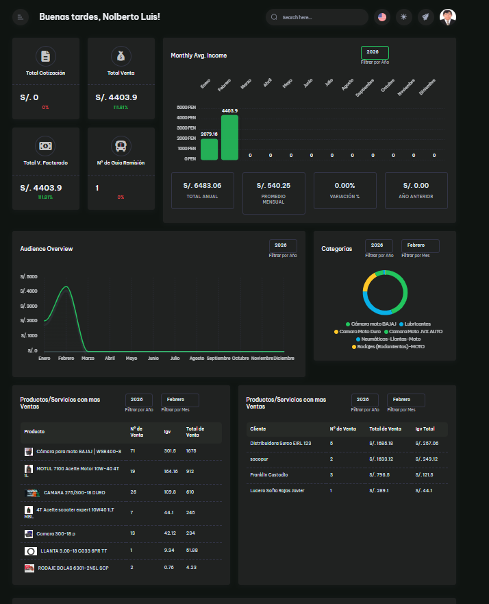
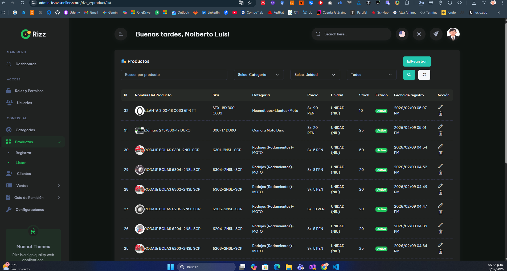
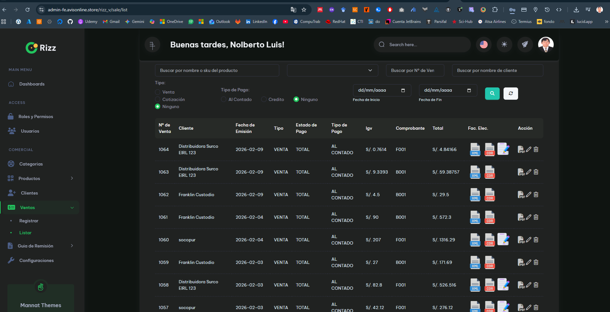

## Inicio rápido (comandos Laravel)

Sigue estos pasos para poner en marcha la API en un entorno de desarrollo:

1. Instalar dependencias:

```bash
composer install
```

2. Copiar y configurar variables de entorno:

```bash
cp .env.example .env
# Edita .env: ajustar DB_*, MAIL_*, JWT_*, y otros valores necesarios
```

3. Generar clave de aplicación y enlazar almacenamiento:

```bash
php artisan key:generate
php artisan storage:link
```

4. Ejecutar migraciones y seeders (desarrollo):

```bash
php artisan migrate --seed
```

5. Crear un usuario de prueba (opción A: desde Tinker):

```bash
php artisan tinker
>>> use App\\Models\\User;
>>> User::create(['name' => 'Demo User', 'email' => 'demo.sum@gmail.com', 'password' => bcrypt('12345678')]);
```

Nota: la cuenta de prueba (usar solo en desarrollo):

- Usuario: `demo.sum@gmail.com`
- Contraseña: `12345678`

6. Iniciar servidor local:

```bash
php artisan serve --host=127.0.0.1 --port=8000
```

Comandos útiles adicionales:

```bash
php artisan migrate:refresh --seed   # reinicia BD y vuelve a sembrar
php artisan queue:work               # procesa colas
./vendor/bin/phpunit                # ejecutar pruebas
```

## Capturas / Imágenes

He incluido referencias a las capturas en el README como placeholders. Para mostrarlas en el README coloca las imágenes en `docs/screenshots/` con estos nombres:

- `docs/screenshots/dashboard.svg`
- `docs/screenshots/product-list.svg`
- `docs/screenshots/sale-list.svg`

Ejemplo de uso en Markdown:

```markdown



```

Si quieres, puedo añadir las imágenes al repositorio por ti: súbelas al chat o indícame la ruta donde están, y las añadiré automáticamente.

---

# API Sistema de Ventas

Descripción breve
- Proyecto: API REST para el sistema de facturación y ventas.
- Tecnología: Laravel (PHP) — backend para manejar clientes, productos, ventas, guías y notas electrónicas.

**Requisitos**
- PHP 8.1+ (o versión compatible)
- Composer
- MySQL / MariaDB (u otra BD soportada por Laravel)
- Extensiones PHP habituales (OpenSSL, PDO, Mbstring, etc.)

**Instalación (local)**
1. Clona el repositorio:

	git clone <repo-url> api-sistema-ventas
	cd api-sistema-ventas

2. Instala dependencias:

	composer install

3. Copia y configura el entorno:

	cp .env.example .env
	- Ajusta `DB_*`, `MAIL_*` y las variables necesarias (JWT, etc.).

4. Genera la clave de la app:

	php artisan key:generate

5. Ejecuta migraciones y seeders (si aplica):

	php artisan migrate --seed

6. Inicia el servidor local:

	php artisan serve --host=127.0.0.1 --port=8000

**Configuración adicional**
- Revisa `config/jwt.php` y `config/services.php` si usas JWT o integraciones externas.
- Para almacenamiento de archivos, configura `FILESYSTEM_DRIVER` en `.env`.

**Ejecutar pruebas**

	./vendor/bin/phpunit

**Rutas y endpoints**
- Las rutas API principales están en [routes/api.php](routes/api.php).
- Autenticación: Revisa los controladores en `app/Http/Controllers` (carpetas `Auth`, `User`, `Sale`, `Product`, etc.).

**Estructura del proyecto (resumen)**
- `app/Models` — modelos Eloquent (User, Company, Client, Product, Sale, etc.)
- `app/Http/Controllers` — controladores API
- `database/migrations` — migraciones de esquema
- `database/seeders` — seeders para datos iniciales
- `routes` — archivos de rutas (`api.php`, `web.php`)

**Despliegue**
- Configurar `.env` en servidor (DB, queue, cache, storage)
- Ejecutar `composer install --no-dev`, `php artisan migrate --force`, y configurar `supervisor` para jobs/queues si es necesario.

**Contribuir**
- Abre un issue para discutir cambios grandes.
- Crea PRs pequeñas y descriptivas.

**Contacto**
- Para dudas, deja un issue o contacta al responsable del proyecto.

---

Si quieres, puedo:
- Añadir ejemplos de llamadas a la API (cURL / Postman) para endpoints comunes.
- Traducir o ampliar secciones específicas.

Indica qué prefieres y lo actualizo.
